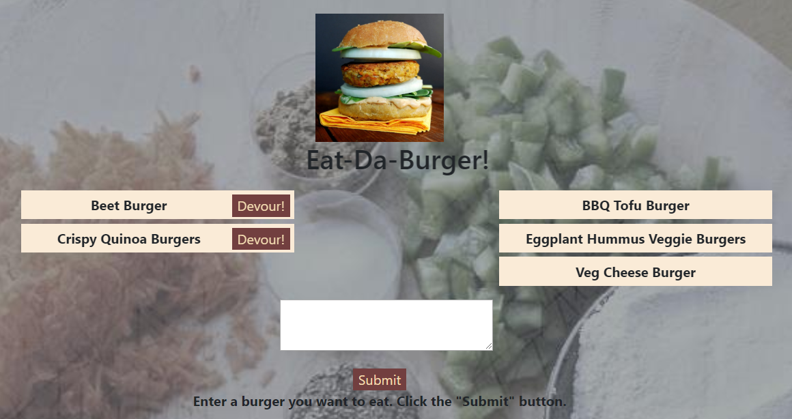

# Eat-Da-Burger
Eat-Da-Burger! is a restaurant app that lets users input the names of burgers they'd like to eat.

Whenever a user submits a burger's name, app will display the burger on the left side of the page -- waiting to be devoured.

Each burger in the waiting area also has a `Devour it!` button. When the user clicks it, the burger will move to the right side of the page.

App stores every burger in a MySQL database, whether devoured or not.

The app uses npm packages express, express-handlebars, mysql, and orm.

Live App Link : https://gentle-tundra-73353.herokuapp.com/

Developed by Minal Karani. email: karani.minal@gmail.com

